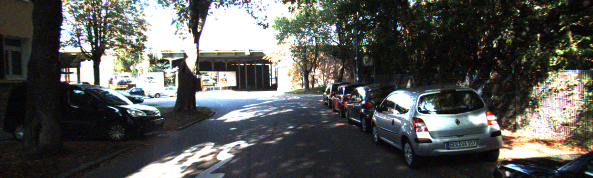
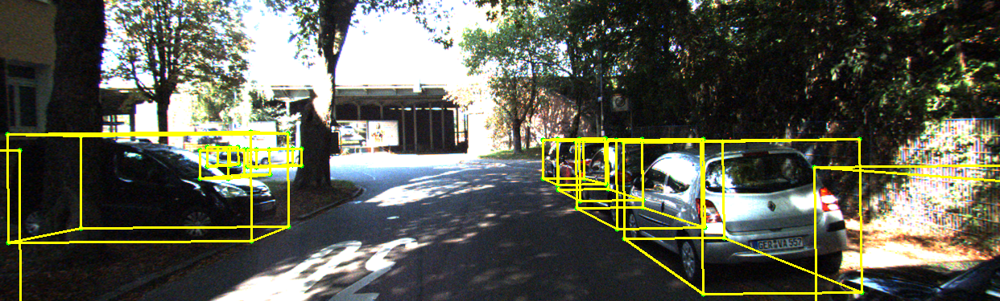

# Projection_3D_Velodyne_to_2D_Image_KITTI
This repository contains Python scripts and utility functions for processing and visualizing 3D LiDAR data and bounding boxes from the KITTI Dataset. It includes code for transforming 3D LiDAR points from Velodyne coordinates to 2D image coordinates, rotating 3D bounding boxes around their center, and drawing the 3D bounding boxes on 2D images.

# Features
* Conversion of 3D points from Velodyne to camera coordinates.
* Projection of 3D points from camera coordinates to 2D image plane.
* Rotation of 3D bounding boxes around their center in 3D space.
* Visualization of 3D bounding boxes on 2D images.
* Handling of calibration matrices and transformation matrices in KITTI dataset.
* Easy-to-use functions with a focus on clarity and flexibility.
# Use Cases
This project is useful for researchers and engineers working in the field of autonomous driving, robotics, and computer vision who want to work with the KITTI dataset. It provides tools to manipulate and visualize 3D LiDAR data and annotations.

# Example Output:
Here is the input image:

Output image with 3D bounding boxes of detected objects:

